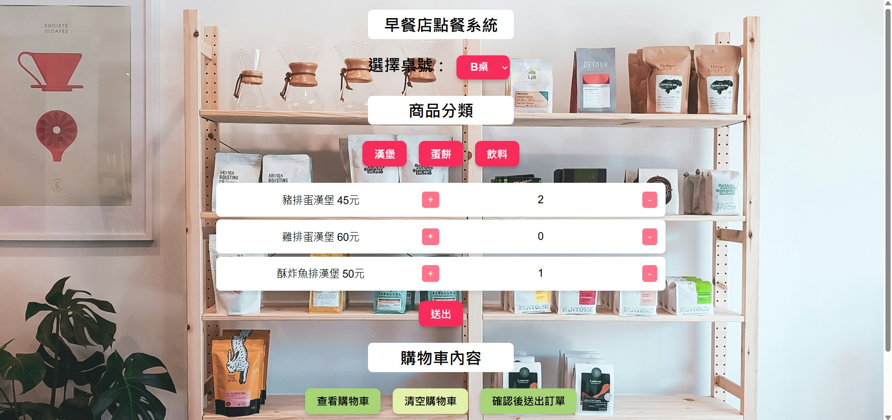
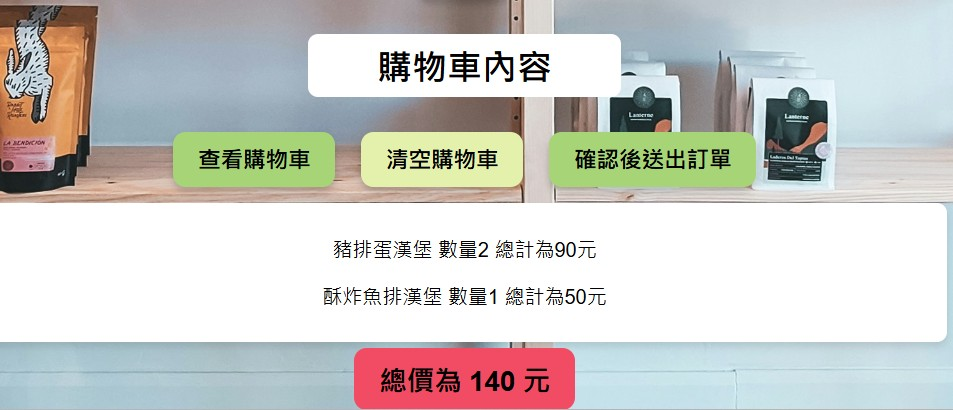
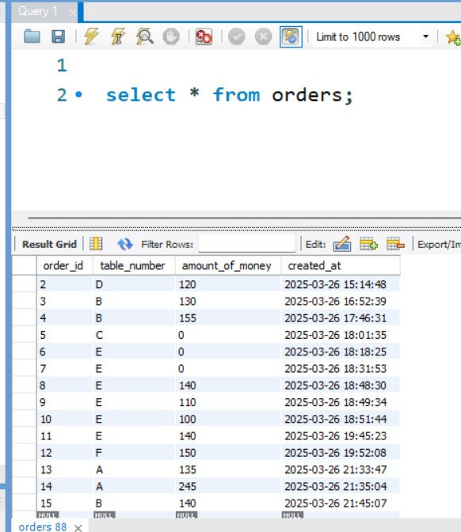

前端網頁檔案為index.html，其中javascript的功能我放在static資料夾，名稱為script.js

後端需要執行的伺服器為main.go，使用vscode開啟此專案資料夾後，在終端機打指令:
```
go run main.go
```
即可執行。
<br>
第一個為首頁圖片，選好餐點後按"送出"
<div align="center">
  
</div>
<br>
第二個為購物車內容，點選"查看購物車"，即可看到所點的餐點以及總金額，最後點確認後送出訂單就會把資料存到MySQL資料庫裡
<div align="center">
  
</div>
<br>
第三個為資料圖送出訂單後圖片
<div align="center">
  
</div>
